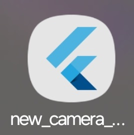
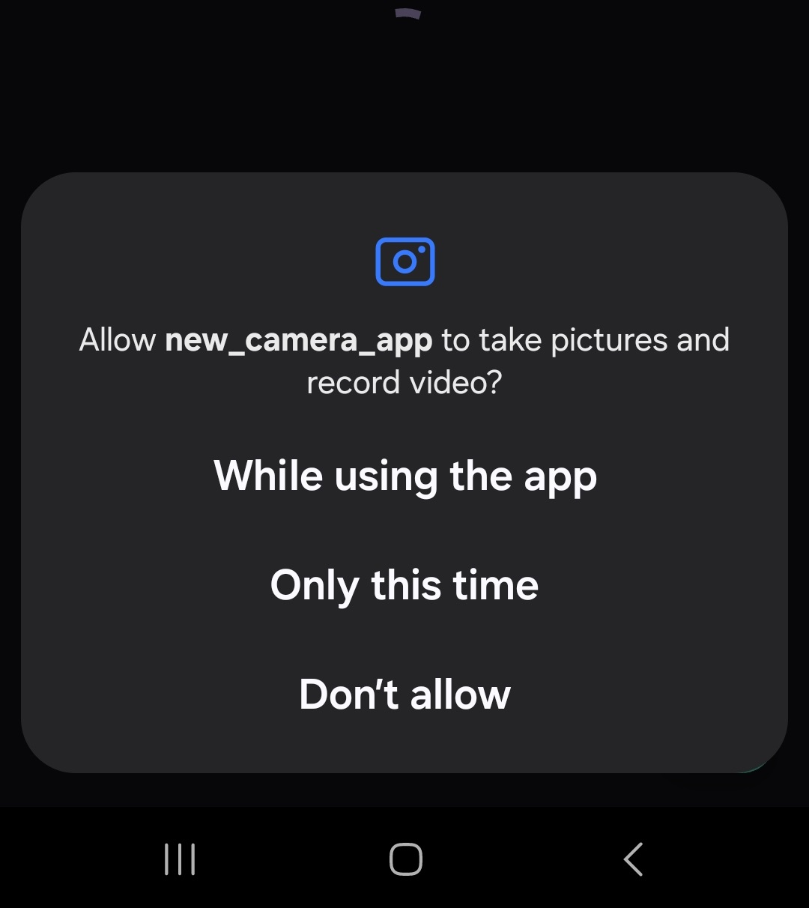
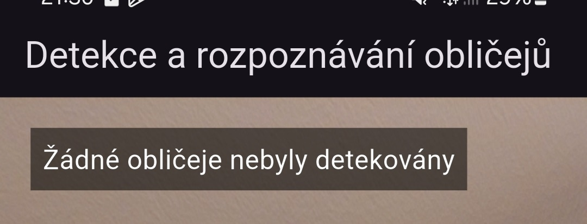
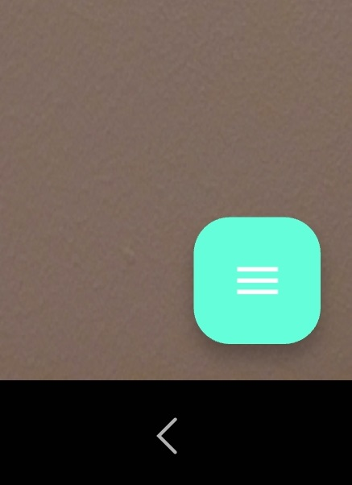
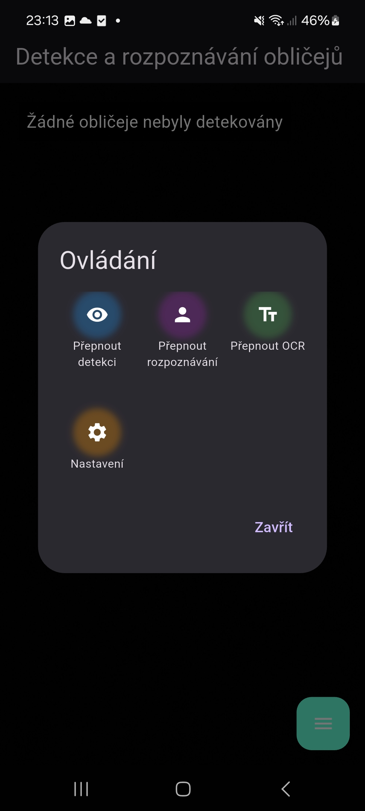
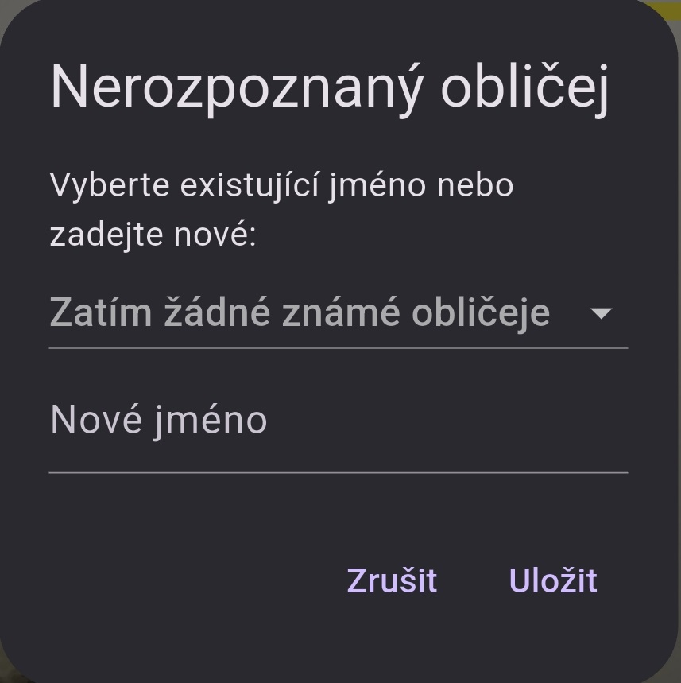
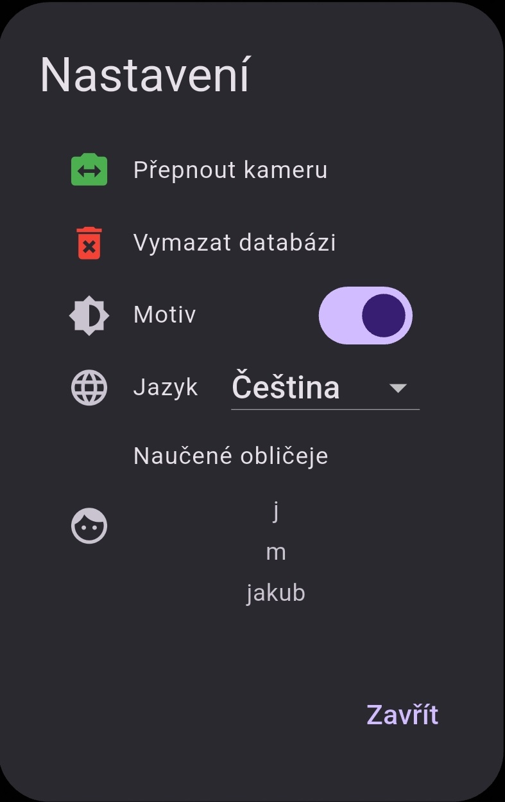

# Návod k používání aplikace FaceApp

Tento návod vám ukáže, jak používat aplikaci FaceApp po její instalaci na telefonu. Postup je jednoduchý a přehledný, aby jej zvládli i začátečníci.

## Spuštění aplikace

- Na domovské obrazovce nebo v seznamu aplikací vyhledejte aplikaci **new_camera_app** a klepněte na ni pro spuštění.

      
    

- Pokud jste aplikaci nainstalovali přes USB ladění, ujistěte se, že je telefon stále připojen k počítači, pokud ji spouštíte poprvé.

## Povolení oprávnění

- Při prvním spuštění vás aplikace vyzve k povolení přístupu ke kameře. Klepněte na "Povolit".

      
    

- Pokud jste oprávnění zamítli, můžete je povolit v nastavení telefonu: 
 "Nastavení" → "Aplikace" → "new_camera_app" → "Oprávnění" → Povolte přístup ke kameře

## Hlavní obrazovka

- Po spuštění aplikace se zobrazí hlavní obrazovka:
    - **Živý náhled kamery** - Uvidíte přímý přenos z kamery telefonu.
    - **Stavový řádek** - V levém horním rohu je text, který ukazuje na aktuální stav (např. "Žádné obličeje nebyly detekovány" nebo "OCR zapnuto").
    

      
    

    - **Tlačítko menu** - V pravém dolním rohu je tlačítko s ikonou menu (tři čárky). Klepnutím na něj otevřete ovládací panel.
    

      
    

## Použítí funkcí aplikace

Aplikace nabízí tři hlavní funkce: detekci obličejů, rozpoznávání obličejů a OCR. Tyto funkce můžete přepínat přes tlačítko menu.

      
    

### Detekce obličejů

- **Zapnutí detekce:**
    - Klepněte na tlačítko menu v pravém dolním rohu
    - V dialogu "Ovládání" klepněte na ikonu oka ("Přepnout detekci").
- **Funkce:**
    - Aplikace automaticky detekuje obličeje v záběru kamery.
    - Detekované obličeje jsou označeny červeným rámečkem.
    - Stavový řádek ukáže počet detekovaných obličejů (např. "Detekováno 2 obličeje").

### Rozpoznávání obličejů

- **Zapnutí detekce:**
    - Klepněte na tlačítko menu v pravém dolním rohu
    - V dialogu "Ovládání" klepněte na ikonu osoby ("Přepnout rozpoznávání").
- **Funkce:**
    - Pokud je obličej rozpoznán (již byl dříve uložen), pod rámečkem se zobrazí jméno a jistota (např. „Jan: 85%“).
    - Pokud obličej není rozpoznán, rámeček bude žlutý. Klepnutím na žlutý rámeček můžete přiřadit jméno:
        - Zobrazí se dialog „Nerozpoznaný obličej“.
        - Vyberte existující jméno z rozbalovací nabídky nebo zadejte nové jméno do textového pole.
        - Klepněte na „Uložit“. Obličej se uloží do databáze a příště bude rozpoznán.
        

      
    

### Optické rozpoznávání textu (OCR)

- **Zapnutí OCR:**
    - Klepněte na tlačítko menu v pravém dolním rohu
    - V dialogu "Ovládání" klepněte na ikonu textu ("Přepnout OCR").
- **Funkce:**
    - Zaměřte kameru na text (např. papír, ceduli).
    - Rozpoznaný text se zobrazí v okně ve spodní části obrazovky.
    - Pokud není žádný text detekován, zobrazí se "Žádný text nebyl detekován".

## Nastavení aplikace
- **Otevření nastavení:**
    - Otevřete menu.
    - Klepněte na ikonu ozubeného kola ("Nastavení").
    - Otevře se vám menu nastavení, kde můžete vybírat další možnosti.
    

      
    

### Možnosti nastavení
#### Přepnout kameru
- Změna přední a zadní kamery.
#### Vymazat databázi
- Klepněte na **Vymazat databázi**, pokud chcete smazat všechny uložené obličeje.
- Potvrďte akci v dialogu "Opravdu chcete smazat všechny naučené obličeje?".
#### Změna motivu
- Klepněte na přepínač **Motiv** pro přepnutí mezi světlým a tmavým režimem.
#### Změna jazyka
- V sekci **Jazyk** vyberte z nabídky "Čeština" nebo "Angličtina".
#### Zobrazení naučených jazyků
- V sekci **Naučené obličeje** uvidíte seznam jmen všech uložených obličejů. Pokud je seznam prázdný, zobrazí se "Žádné naučené obličeje".

## Tipy pro lepší použití
- **Osvětlení:** Ujistěte se, že je prostředí dobře osvětlené, aby detekce obličejů a OCR fungovaly přesně.
- **Přesnost rozpoznávání:** Pokud aplikace nerozpoznává obličej správně, zkuste ho uložit znovu za jiných světelných podmínek.
- **Text a OCR:** Pro nejlepší výsledky při OCR používejte kontrastní text (např. černý text na bílém pozadí) a držte telefon stabilně.
- **Přepínání kamer:** Pokud detekujete svůj vlastní obličej, použijte přední kameru. Pro text nebo obličeje jiných osob je lepší zadní kamera.

## Řešení problémů
### Kamera nefunguje
- Zkontrolujte, zda má aplikace přístup ke kameře v nastavení telefonu.
- Restartujte aplikaci nebo telefon.
### Detekce obličejů selhává
- Ujistěte se, že je dostatek světla a obličej je v záběru kamery.
- Zkuste přepnout na jinou kameru.
### OCR nerozpoznává text
- Zaměřte kameru přímo na text a vyhněte se odleskům.
- Zkontrolujte, zda je text čitelný (není rozmazaný nebo příliž malý).
### Aplikace spadne
- Ujistěte se, že máte nejnovější verzi aplikace.
- Zkuste vymazat mezipaměť aplikace s nastavení telefonu.
- Zkuste přeinstalovat aplikaci v telefonu.

## Ukončení aplikace
- Pro ukončení aplikace jednoduše klepněte na tlačítko "Zpět" nebo "Domů" na telefonu.
- Aplikace automaticky uvolní kameru, takže není potřeba ji ručně zavírat.

S tímto návodem byste měli být schopni plně využívat všechny funkce FaceApp. Pokud máte další otázky nebo potřebujete pomoc, podívejte se do dokumentace nebo kontaktujte podporu.